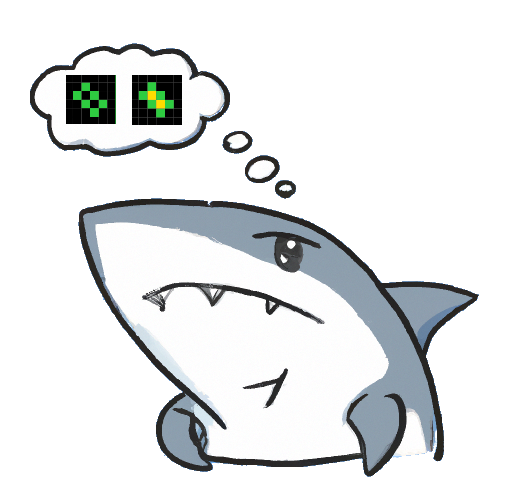

# shARCathon

## Project Structure

.
├──── cnn : cnn baseline model
├──── data : extract ARC-800 zip here
├──── examples : contains example images of tasks and cnn output
├──── gpt2 : pipeline to finetune gpt2 + measurements
├──── gptj : pipeline to finetune gptj
├──── gptneo : pipeline to finetune gptneo + measurements
├──── images : images used in readme + report
├──── llm : 
├──── results : all output files of all models and all prompting techniques
├──── config.py : contains information for data splits
├──── dataset_exploration.ipynb : notebook used for data exploration
├──── evaluate_local_models.py : evalaute local models using our evaluation metrics
├──── filter_data.py : run this to create the data splits after extracting the zip in data
├──── query_gpt.py : make gpt api calls and save results
├──── requirements.txt : pip requirements
├──── run_local_models.sh : run model and prompting technique
├──── task_avaluation.ipynb : visualize different tasks + task statistics
├──── task.json : contains manual mapping of task labels to tasks
├──── train_cnn.py : train cnn baseline model
├──── utils.py : util functions
